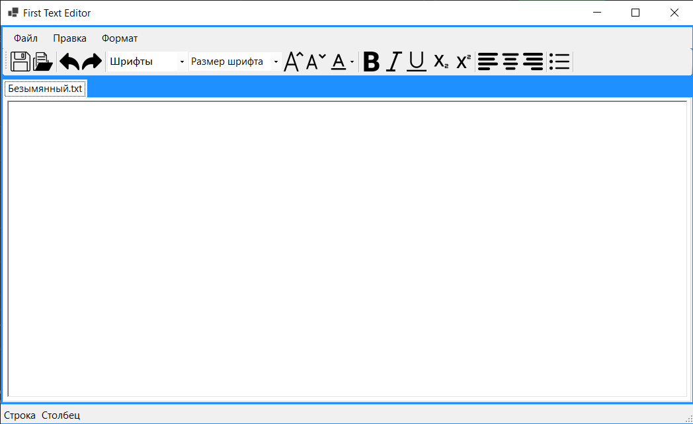
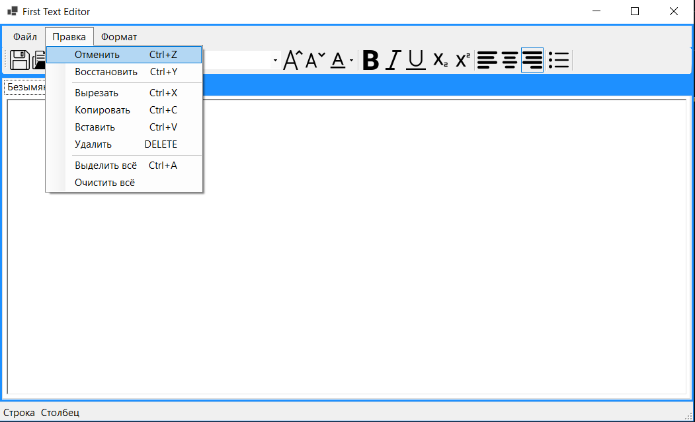
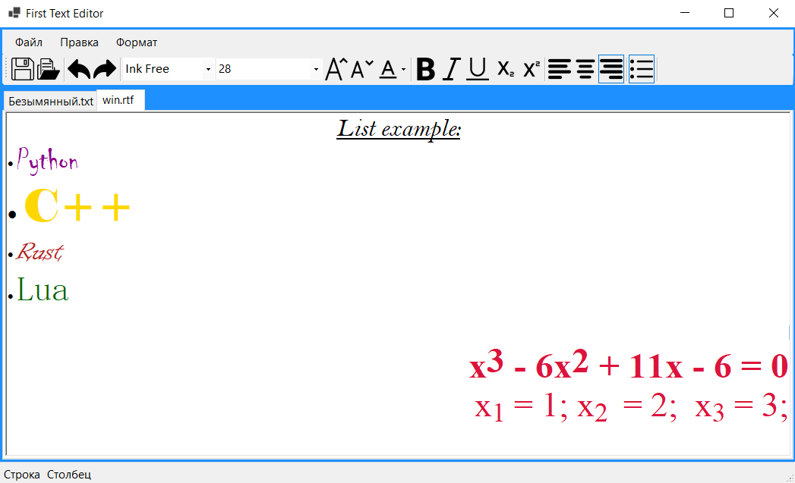

# Text Editor - Windows Forms

## Description 
This is my first UI app. Since first time working with C# and Windows Forms i decided to use https://github.com/hjohnson12/TextEditor.git repo as a reference.
I like disign and Font Color implementation of hjohnson12, because of that i copy that to my own project.

## Build with
C#, Windows Forms, Visual Studio 2022

## Functions
- Basic text processing(align, font, color etc.)
- Toolbar and menubar
- Shortscut(copy, paste, open etc.)
- Open .txt and .rtf files
- Open multyple files
- Scalable interface

## Screenshots
- #### App window after launch

- #### Shortcuts and Menutool

- #### Basic example

## Future updates
- Add count of rows and column
- Add context menu
- Add "Close" button for tabs
- Increase general user's experience 
